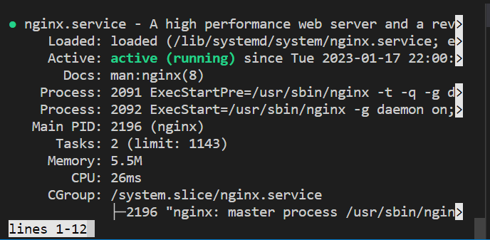
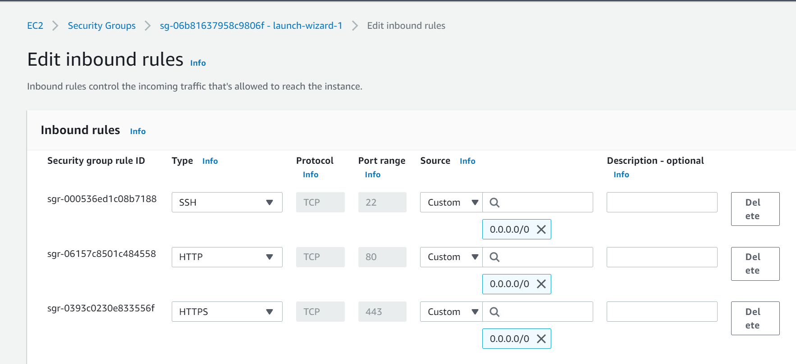
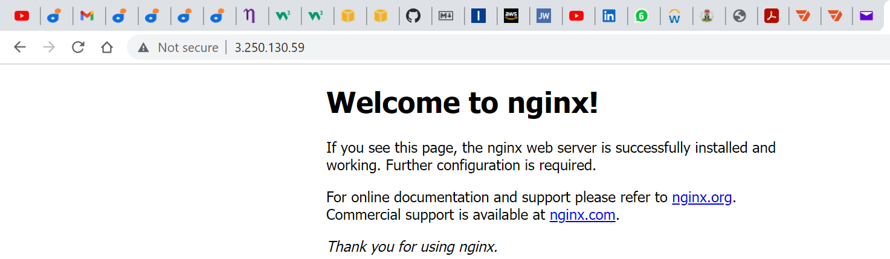

# LEMP Stack Implementation
## Installing the Nginx Web Server

To display web pages to our site visitors, we are going to employ Nginx, a high-performance web server. We’ll use the apt package manager to install this package.

Since this is our first time using apt for this session, start off by updating your server’s package index. Following that, you can use apt install to get Nginx installed:

Since this is our first time using apt for this session, start off by updating your server’s package index. Following that, you can use apt install to get Nginx installed:

`sudo apt update`
`sudo apt install nginx`

To verify that nginx was successfully installed and is running as a service in Ubuntu, run:

`sudo systemctl status nginx`

At this point ensure TCP Port 80 which is default port that web brousers use to access web pages in the Internet is open.

Our server is running and we can access it locally and from the Internet (Source 0.0.0.0/0 means ‘from any IP address’).

First, let us try to check how we can access it locally in our Ubuntu shell, run:

curl http://localhost:80
or
curl http://127.0.0.1:80

Now it is time for us to test how our Nginx server can respond to requests from the Internet.
Open a web browser of your choice and try to access following url

http://Public-IP-address:80

To retrieve your Public IP address, other than to check it in AWS Web console, is to use following command:

curl -s http://169.254.169.254/latest/meta-data/public-ipv4

You should see following page, then your web server is now correctly installed and accessible through your firewall

##STEP 2 — INSTALLING MYSQL

Now that you have a web server up and running, you need to install a Database Management System (DBMS) to be able to store and manage data for your site in a relational database. MySQL is a popular relational database management system used within PHP environments, so we will use it in our project.

Again, use ‘apt’ to acquire and install this software:

`sudo apt install mysql-server`

When the installation is finished, log in to the MySQL console by typing:

`sudo mysql`

It’s recommended that you run a security script that comes pre-installed with MySQL. This script will remove some insecure default settings and lock down access to your database system. Before running the script you will set a password for the root user, using mysql_native_password as default authentication method. We’re defining this user’s password as PassWord.1.

Now we start the interactive script by running:

`sudo mysql_secure_installation`

Regardless of whether you chose to set up the VALIDATE PASSWORD PLUGIN, your server will next ask you to select and confirm a password for the MySQL root user. This is not to be confused with the system root. The database root user is an administrative user with full privileges over the database system. Even though the default authentication method for the MySQL root user dispenses the use of a password, even when one is set, you should define a strong password here as an additional safety measure. We’ll talk about this in a moment.

For the rest of the questions, press Y and hit the ENTER key at each prompt. This will prompt you to change the root password, remove some anonymous users and the test database, disable remote root logins, and load these new rules so that MySQL immediately respects the changes you have made.

When you’re finished, test if you’re able to log in to the MySQL console by typing:

`sudo mysql -p`

Notice the -p flag in this command, which will prompt you for the password used after changing the root user password.

To exit the MySQL console, type:

`mysql> exit`

Notice that you need to provide a password to connect as the root user.

For increased security, it’s best to have dedicated user accounts with less expansive privileges set up for every database, especially if you plan on having multiple databases hosted on your server.

## Step 3 – Installing PHP

We have Nginx installed to serve our content and MySQL installed to store and manage your data. Now we can install PHP to process code and generate dynamic content for the web server.

While Apache embeds the PHP interpreter in each request, Nginx requires an external program to handle PHP processing and act as a bridge between the PHP interpreter itself and the web server. This allows for a better overall performance in most PHP-based websites, but it requires additional configuration. You’ll need to install php-fpm, which stands for “PHP fastCGI process manager”, and tell Nginx to pass PHP requests to this software for processing. Additionally, you’ll need php-mysql, a PHP module that allows PHP to communicate with MySQL-based databases. Core PHP packages will automatically be installed as dependencies.

To install these 2 packages at once, run:

`sudo apt install php-fpm php-mysql`

## STEP 4 — CONFIGURING NGINX TO USE PHP PROCESSOR

When using the Nginx web server, we can create server blocks (similar to virtual hosts in Apache) to encapsulate configuration details and host more than one domain on a single server. In this implementation, we will use projectLEMP as an example domain name.

On Ubuntu 20.04, Nginx has one server block enabled by default and is configured to serve documents out of a directory at /var/www/html. While this works well for a single site, it can become difficult to manage if you are hosting multiple sites. Instead of modifying /var/www/html, we’ll create a directory structure within /var/www for the your_domain website, leaving /var/www/html in place as the default directory to be served if a client request does not match any other sites.

Create the root web directory for your_domain as follows:

`sudo mkdir /var/www/projectLEMP`

Next, assign ownership of the directory with the $USER environment variable, which will reference your current system user:

`sudo chown -R $USER:$USER /var/www/projectLEMP`

Then, open a new configuration file in Nginx’s sites-available directory using your preferred command-line editor. Here, we’ll use nano:

`sudo nano /etc/nginx/sites-available/projectLEMP`

This will create a new blank file. Paste in the following bare-bones configuration:
#/etc/nginx/sites-available/projectLEMP

server {
    listen 80;
    server_name projectLEMP www.projectLEMP;
    root /var/www/projectLEMP;

    index index.html index.htm index.php;

    location / {
        try_files $uri $uri/ =404;
    }

    location ~ \.php$ {
        include snippets/fastcgi-php.conf;
        fastcgi_pass unix:/var/run/php/php8.1-fpm.sock;
     }

    location ~ /\.ht {
        deny all;
    }

}

